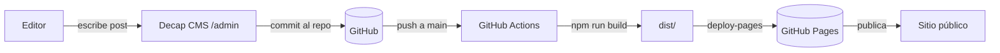

# AstroJS + Decap CMS — Blog con Landing Page

Landing page responsiva (móvil y desktop) con navbar, más un blog administrado con **Decap CMS** y construido con **AstroJS**.

## Tecnologías

- **[AstroJS](https://astro.build)** — Framework de contenido estático (v7).
- **[Decap CMS](https://github.com/decaporg/decap-cms)** — CMS de Git-based para administrar el blog.
- **Markdown** — Los posts del blog se escriben en `src/content/blog/` con Frontmatter.

## Estructura del proyecto

```
.
├── public/
│   ├── admin/          # Widget de Decap CMS (index.html + config.yml)
│   └── uploads/        # Imágenes subidas desde Decap CMS
├── src/
│   ├── components/     # Componentes reutilizables (Navbar, Footer, ...)
│   ├── content/
│   │   ├── blog/       # Posts del blog (Markdown)
│   │   └── config.ts   # Esquema del content collection "blog"
│   ├── layouts/        # Layouts (Layout.astro, BlogPost.astro, ...)
│   └── pages/          # Rutas: index, blog, blog/[slug], 404, ...
├── astro.config.mjs
├── package.json
└── tsconfig.json
```

## Requisitos previos

- Node.js 20 o superior
- npm (o pnpm / yarn / bun)

## Puesta en marcha

```bash
# Instalar dependencias
npm install

# Desarrollo en Windows (levanta el proxy de Decap CMS y el dev server)
start-dev.bat

# Alternativa: servidor de desarrollo solo
npm run dev

# Build de producción
npm run build

# Previsualizar el build
npm run preview

# Lint / typecheck (si están configurados)
npm run lint
npm run check
```

## Configurar Decap CMS

Decap CMS **no usa usuario/contraseña propios**: autentica contra GitHub (OAuth) o funciona sin credenciales en local.

1. **Local (sin credenciales)**: el proyecto usa `local_backend: true`. Ejecuta `start-dev.bat` (o en terminales separadas: `npx decap-server` + `npm run dev`). Luego abre `http://localhost:4321/admin/`. Los cambios se escriben directo en el repo local.

2. **Producción (GitHub Pages)**: el backend es `github` (OAuth). Configura `backend.repo` en `public/admin/config.yml` con tu `usuario/repo`. Los editores se loguean con su cuenta de GitHub (requiere push access al repo). El OAuth por defecto lo facilita Netlify; también se puede usar un [OAuth client propio](https://decapcms.org/docs/external-oauth-clients/).

> No hace falta apagar `local_backend` al desplegar: si el proxy no está corriendo, el CMS usa automáticamente el backend remoto definido en `config.yml`.

## Escribir posts

Dos opciones:

1. **Desde el CMS**: entrar en `/admin/`, autenticarse y crear contenido desde la interfaz.
2. **Directo en el repo**: crear un archivo `src/content/blog/mi-post.md` siguiendo el frontmatter del esquema en `src/content.config.ts`.

> Al compilar, Astro lee los `.md` ya presentes en `src/content/blog/` (loader `glob()`). El CMS es quien los escribe ahí haciendo commits al repo; no consulta al CMS en build.

## Despliegue en GitHub Pages

1. Repo **público** y en Settings → Pages seleccionar **GitHub Actions** como source.
2. Verificar que `site` en `astro.config.mjs` apunte a la URL real (ej. `https://edgardo001.github.io`).
3. Configurar `backend.repo` en `public/admin/config.yml` con `usuario/repo`.
4. El workflow `.github/workflows/deploy.yml` construye y publica el sitio en cada push a `main`, **incluidos los commits del CMS**, así los posts nuevos aparecen solos.



## Comandos útiles

| Comando            | Acción                            |
| ------------------ | --------------------------------- |
| `npm install`      | Instala dependencias              |
| `npm run dev`      | Inicia servidor de desarrollo     |
| `npm run build`    | Genera el sitio estático          |
| `npm run preview`  | Previsualiza el build             |
| `npm run check`    | Typecheck + validación de content |

## Licencia

MIT
