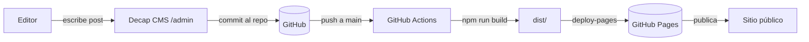

# AstroJS + Decap CMS — Blog con Landing Page

Landing page responsiva (móvil y desktop) con navbar, más un blog administrado con **Decap CMS** y construido con **AstroJS**.

## Tecnologías

- **[AstroJS](https://astro.build)** — Framework de contenido estático (v7).
- **[Decap CMS](https://github.com/decaporg/decap-cms)** — CMS de Git-based para administrar el blog.
- **Markdown** — Los posts se escriben en `src/content/*/` con Frontmatter.

## Estructura del proyecto

```
.
├── public/
│   ├── admin/          # Widget de Decap CMS (index.html + config.yml)
│   └── uploads/        # Imágenes subidas desde Decap CMS
├── src/
│   ├── components/     # Componentes reutilizables (Navbar, PostList, PostDetail, ...)
│   ├── content/
│   │   ├── blog/               # Posts del blog general
│   │   ├── blog_rrhh/          # Posts del Blog RRHH
│   │   ├── blog_interno/       # Posts del Blog Interno
│   │   ├── blog_externo/       # Posts del Blog Externo
│   │   ├── blog_comunicados/   # Posts del Blog Comunicados
│   │   └── config.ts           # Esquemas de las content collections
│   ├── data/
│   │   └── blogs.ts    # Registro central de blogs (label, ruta, enabled)
│   ├── layouts/        # Layouts (Layout.astro)
│   └── pages/          # Rutas: index, [blog]/index, [blog]/[slug], 404, ...
├── astro.config.mjs
├── package.json
└── tsconfig.json
```

## Múltiples blogs (multi-blog)

El sitio soporta **un blog por colección**: cada blog es una content collection de Astro y, a la vez, una colección de Decap CMS con su propia carpeta de Markdown y su listado en el sidebar de `/admin/`.

| Blog            | Colección (Decap/Astro) | Carpeta                   | Ruta               |
| --------------- | ----------------------- | ------------------------- | ------------------ |
| Blog (general)  | `blog`                  | `src/content/blog/`       | `/blog/`           |
| Blog RRHH       | `blog_rrhh`             | `src/content/blog_rrhh/`  | `/blog_rrhh/`      |
| Blog Interno    | `blog_interno`          | `src/content/blog_interno/` | `/blog_interno/` |
| Blog Externo    | `blog_externo`          | `src/content/blog_externo/` | `/blog_externo/` |
| Blog Comunicados| `blog_comunicados`      | `src/content/blog_comunicados/` | `/blog_comunicados/` |

Las rutas no se crean una por blog: `src/pages/[blog]/index.astro` y `src/pages/[blog]/[slug].astro` generan dinámicamente todas las páginas a partir del registro **`src/data/blogs.ts`**.

### Encender / apagar blogs (flag en tiempo de compilación)

Cada blog tiene un flag `enabled` en `src/data/blogs.ts`. Cambiar `enabled: false` **oculta el blog del navbar** y **deja de generar sus rutas** (listado y posts) en el próximo build:

```ts
export const blogs: BlogInfo[] = [
  // ...
  {
    name: "blog_externo",
    label: "Blog Externo",
    // ...
    enabled: false, // ← blog apagado: no aparece en navbar ni genera páginas
  },
];
```

> Alternativa futura (no implementada): encender/apagar desde **Decap CMS** (una colección de configuración del sitio que un editor edita en `/admin/` y el build lee en vez de `blogs.ts`). Ver detalles en `FAQ.md`.

Para añadir otro blog (`blogN`):

1. En `public/admin/config.yml` agrega una colección apuntando a `src/content/blogN` (reusa los campos con el anchor YAML `*campos_blog`).
2. En `src/content.config.ts` define la collection `blogN` con el loader `glob()` apuntando a `./src/content/blogN`.
3. Agrega una entrada en `src/data/blogs.ts` con `enabled: true`. Las rutas `[blog]` y el navbar la toman automáticamente.
4. Crea las entradas de ejemplo en `src/content/blogN/`.
5. Verifica con `npm run check` y `npm run build`.

En `/admin/`, cada colección aparece como una entrada separada en el sidebar; al crear una entrada eliges en qué blog la publicas.

## Requisitos previos

- Node.js 20 o superior
- npm (o pnpm / yarn / bun)

## Puesta en marcha

```bash
# Instalar dependencias
npm install

# Desarrollo en Windows (levanta el proxy de Decap CMS y el dev server)
start-dev.bat
```

> `start-dev.bat` valida primero que el **puerto 8081** (proxy de Decap CMS) esté libre. Si está ocupado, lo reporta con el proceso/PID que lo usa y **aborta sin iniciar Astro** (para no levantar un `/admin/` que pediría login de GitHub). Para liberarlo, ejecuta **`kill-dev.bat`** (muestra quién ocupa el puerto y pregunta antes de matar; `kill-dev.bat 8082` para otro puerto). Si solo quieres el sitio sin el CMS, usa `npm run dev` manualmente.

# Alternativa: servidor de desarrollo solo
npm run dev

# Build de producción
npm run build

# Previsualizar el build
npm run preview

# Lint / typecheck (si están configurados)
npm run lint
npm run check
```

## Configurar Decap CMS

Decap CMS **no usa usuario/contraseña propios**: en producción autentica vía **DecapBridge** y en local funciona sin credenciales.

1. **Local (sin credenciales)**: el proyecto usa `local_backend: true`. Ejecuta `start-dev.bat` (o en terminales separadas: `npx decap-server` + `npm run dev`). Luego abre `http://localhost:4321/admin/`. Los cambios se escriben directo en el repo local.

2. **Producción (GitHub Pages)**: el backend es `git-gateway` con **DecapBridge** (auth PKCE). El login lo gestiona DecapBridge (contraseña, Google o Microsoft) para los colaboradores invitados; los commits se firman con el nombre del autor. Ver el setup en el `FAQ.md`.

> No hace falta apagar `local_backend` al desplegar: si el proxy no está corriendo, el CMS usa automáticamente el backend remoto definido en `config.yml`.

## Escribir posts

Dos opciones:

1. **Desde el CMS**: entrar en `/admin/`, autenticarse, elegir el blog (colección) en el sidebar y crear contenido desde la interfaz.
2. **Directo en el repo**: crear un archivo `src/content/<blog>/mi-post.md` siguiendo el frontmatter del esquema en `src/content.config.ts`.

> Al compilar, Astro lee los `.md` ya presentes en cada carpeta de `src/content/*/` (loader `glob()`). El CMS es quien los escribe ahí haciendo commits al repo; no consulta al CMS en build.

## SEO y sindicación

- **Open Graph / Twitter Cards**: `og:*` y `twitter:*` en `src/layouts/Layout.astro` (imagen absoluta desde el frontmatter `image`).
- **Sitemap**: generado con `@astrojs/sitemap` en cada build (`/sitemap-index.xml`), excluye `/admin/`.
- **RSS**: feed del blog en `/rss.xml` (`src/pages/rss.xml.ts`) con `@astrojs/rss`.

## Despliegue en GitHub Pages

1. Repo **público** y en Settings → Pages seleccionar **GitHub Actions** como source.
2. `site` en `astro.config.mjs` apunta a **`https://astrojs-blog-integration-cms-decapcms.edgardovasquez.cl`** (subdominio personalizado).
3. Configurar `backend.repo` en `public/admin/config.yml` con `usuario/repo`.
4. El workflow `.github/workflows/deploy.yml` construye y publica el sitio en cada push a `main`, **incluidos los commits del CMS**, así los posts nuevos aparecen solos.

### Dominio personalizado

- El sitio vive en `https://astrojs-blog-integration-cms-decapcms.edgardovasquez.cl`, servido en la **raíz** del subdominio.
- El DNS está en **Cloudflare**: agregar un registro **CNAME** `astrojs-blog-integration-cms-decapcms` → `edgardo001.github.io` (proxy DNS-only).
- El dominio personalizado del project site se configura en el repo (Settings → Pages → Custom domain); GitHub lo verifica y emite el HTTPS automáticamente.
- El dominio `edgardovasquez.cl` pertenece al *user site* `edgardo001.github.io`; de ahí salen las redirecciones `github.io` → `edgardovasquez.cl`.



## Comandos útiles

| Comando            | Acción                            |
| ------------------ | --------------------------------- |
| `npm install`      | Instala dependencias              |
| `npm run dev`      | Inicia servidor de desarrollo     |
| `npm run build`    | Genera el sitio estático          |
| `npm run preview`  | Previsualiza el build             |
| `npm run check`    | Typecheck + validación de content |

## Licencia

MIT
